# ApexCore Secure Linux Azure Infrastructure

## Project Overview

This project demonstrates the design and implementation of a secure three-tier Azure infrastructure using Linux servers.

The objective was to build a production-style environment with:

- A public-facing Web Server
- A private Database Server
- Azure Virtual Network segmentation
- Network Security Group controls
- Linux firewall hardening
- Secure MySQL connectivity
- Least-privilege database access

The project focuses on implementing practical cloud security controls using Microsoft Azure and Linux administration.

---

# Architecture

```
                         Internet
                            |
                            |
                  ApexCore Web Server
                  Ubuntu 24.04 LTS
                  Nginx Web Server
                  Private IP: 10.50.0.68
                            |
                            |
                  TCP 3306 MySQL Access
                            |
                            |
                  ApexCore Database Server
                  Ubuntu 24.04 LTS
                  MySQL 8.0
                  Private IP: 10.50.0.69
```

---

# Azure Infrastructure

## Environment Details

| Component | Details |
|---|---|
| Cloud Provider | Microsoft Azure |
| Operating System | Ubuntu 24.04 LTS |
| Web Server | Nginx |
| Database Server | MySQL 8.0 |
| Network | Azure Virtual Network |
| Network Security | Azure NSG |
| Host Firewall | UFW |

---

# Virtual Network Design

The infrastructure was deployed using separate network layers to isolate application and database workloads.

## Azure Virtual Machines

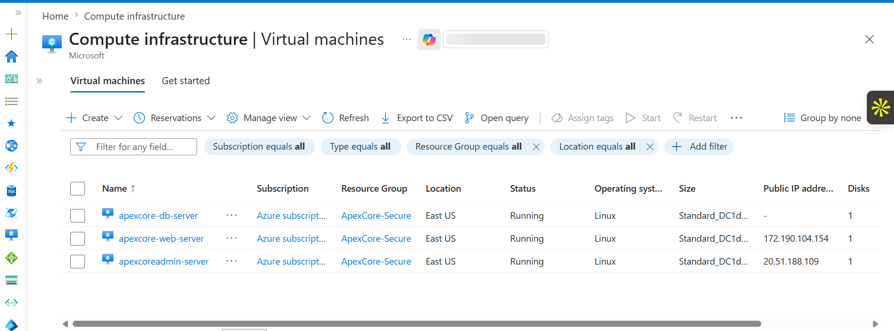

## Azure Subnet Configuration

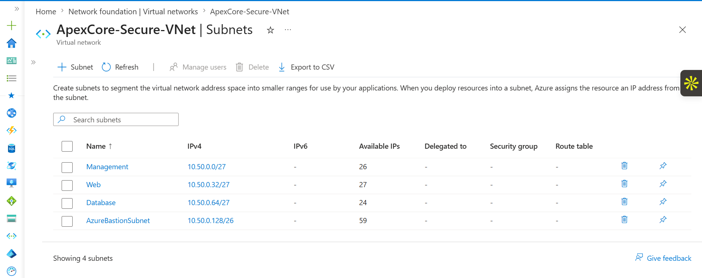

---

# Web Server Configuration

The Web Server was deployed on Ubuntu Linux and configured with Nginx.

## Nginx Installation

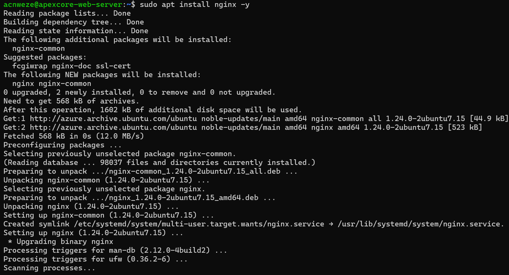

## Nginx Service Status

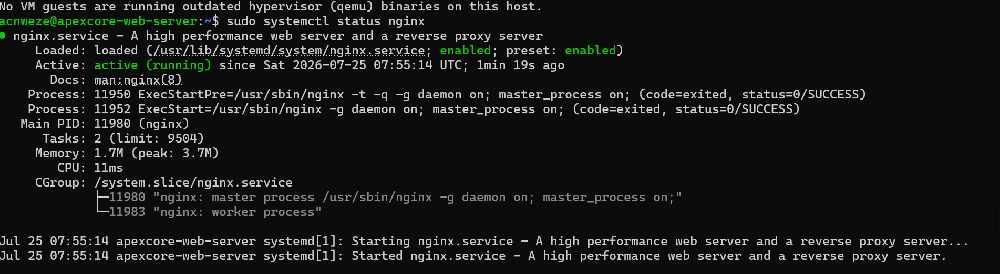

## Web Page Configuration

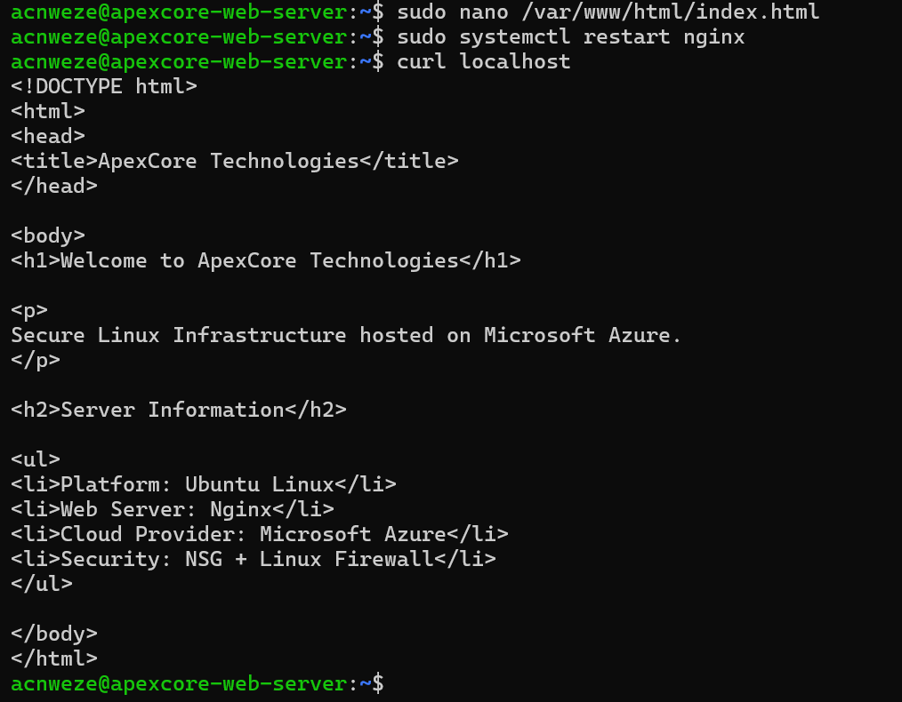

## Web Server Testing

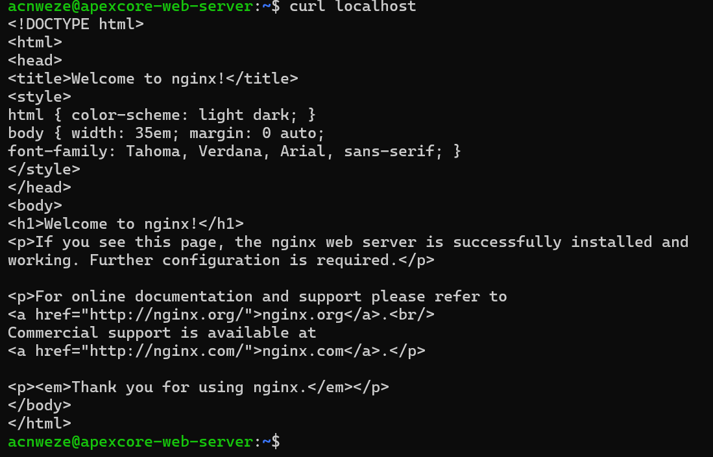

---

# Database Server Configuration

The Database Server was deployed as a private backend service.

## MySQL Installation

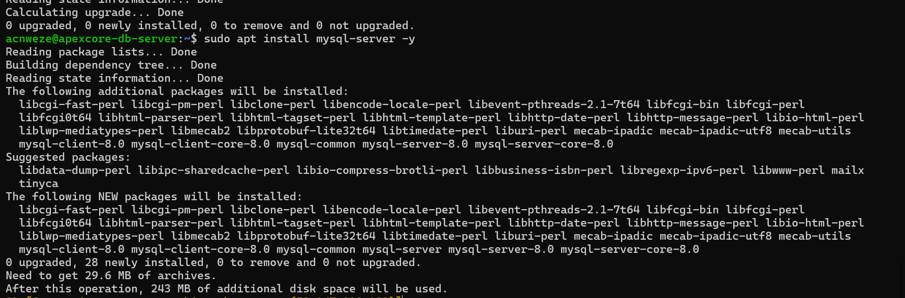

## MySQL Service Status

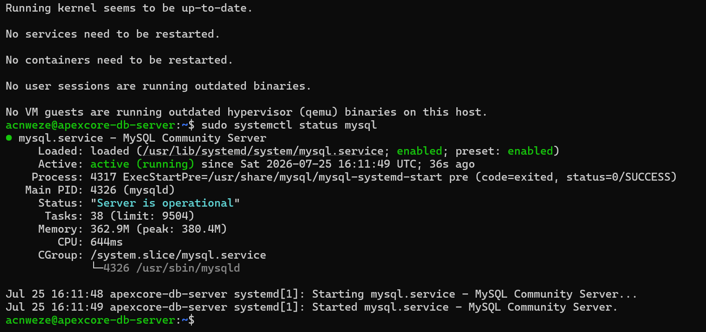

---

# Database Security Configuration

## MySQL Private Network Binding

MySQL was configured to listen only on the private database IP address.

```
10.50.0.69:3306
```

This prevents direct public exposure of the database service.

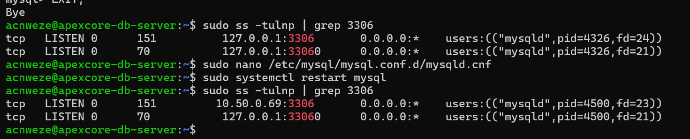

---

# Application Database Setup

Created application database:

```
apexcore_app
```

Created application database user:

```
apexcore_web
```

Application table:

```
users
```

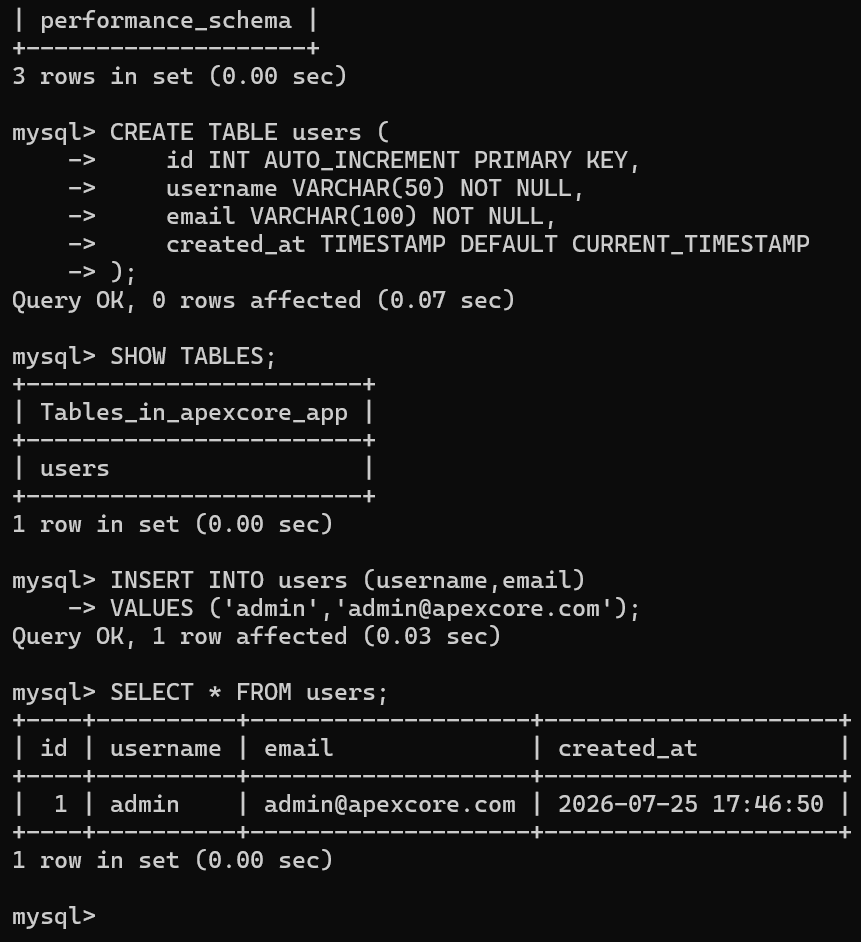

---

# Secure Web Server to Database Communication

The Web Server was configured to communicate with the Database Server using private networking.

Web Server:

```
10.50.0.68
```

Database Server:

```
10.50.0.69
```

Communication flow:

```
Web Server
    |
    |
    | TCP 3306
    |
    v
Database Server
```

## MySQL Connection Test

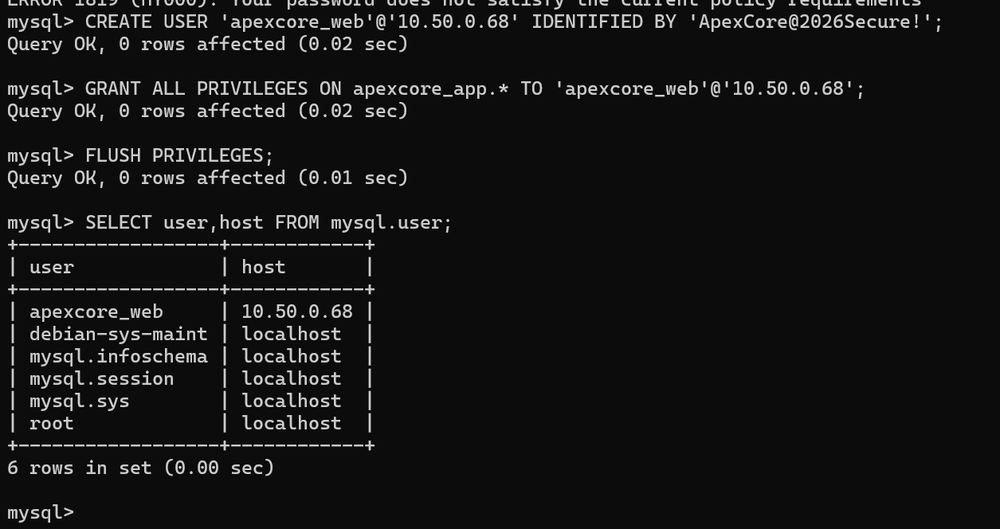

---

# Network Security Controls

## Azure Network Security Groups

Network Security Groups were configured to restrict traffic between application and database layers.

## Web Server NSG Rules

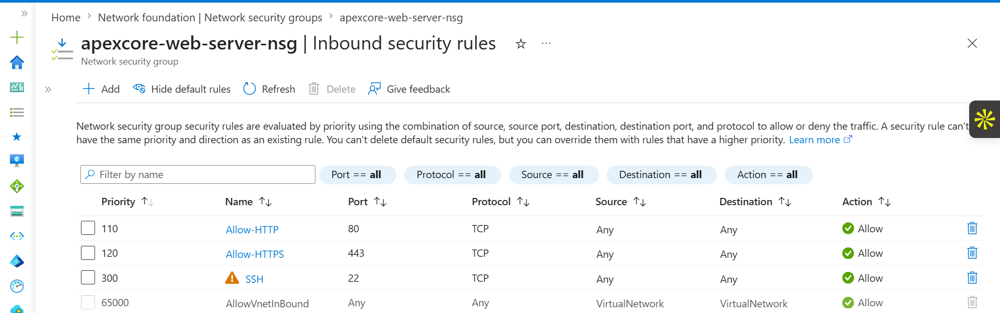

## Database Server NSG Rules


Database access was restricted to the Web Server private IP only.

---

# Linux Firewall Security

UFW firewall rules were configured on the Database Server.

Allowed traffic:

```
SSH:
Source: 10.50.0.68
Port: 22

MySQL:
Source: 10.50.0.68
Port: 3306
```

## Firewall Configuration

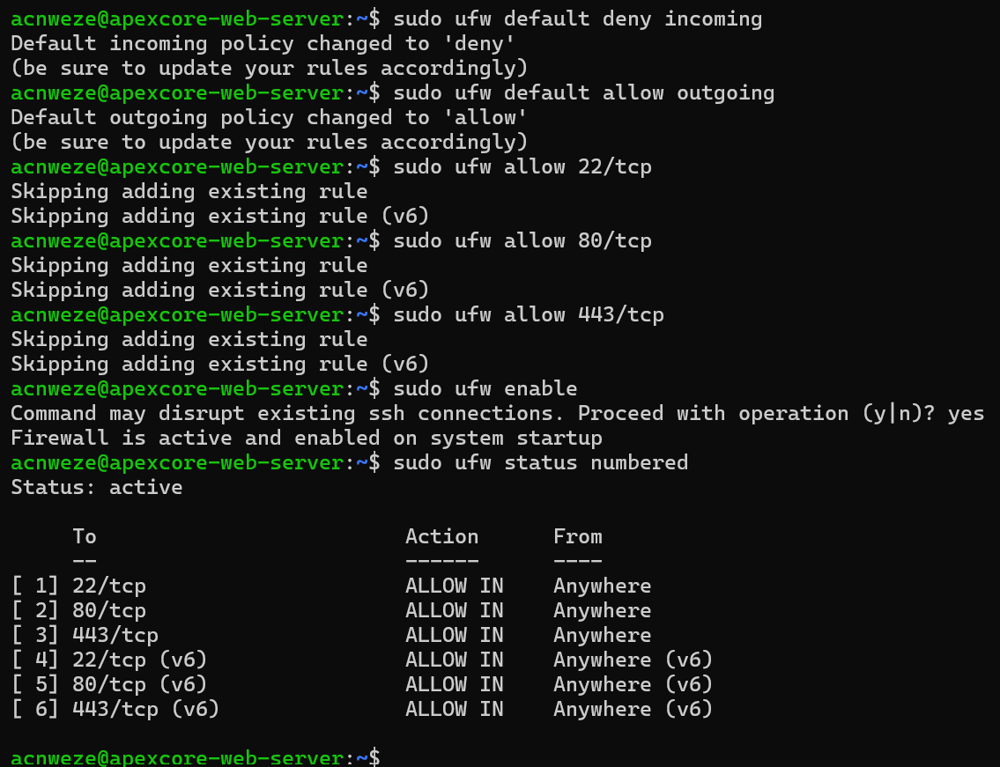

---

# Database User Permissions

The application database user was configured with controlled permissions.

User:

```
apexcore_web
```

Permissions:

```
GRANT ALL PRIVILEGES ON apexcore_app.*
```

The user does not have global MySQL administration privileges.

## MySQL User Permissions

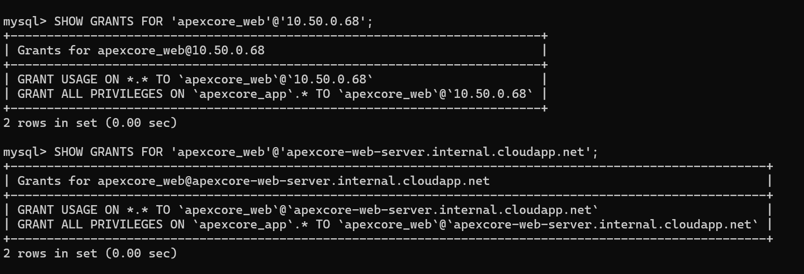

---

# Security Validation

The following security tests were performed.

| Test | Result |
|---|---|
| Web Server reaches Database Server | Passed |
| MySQL remote authentication | Passed |
| Database user permissions | Passed |
| MySQL private binding | Passed |
| Linux firewall restrictions | Passed |
| Azure NSG restrictions | Passed |
| Database table creation | Passed |
| Application database access | Passed |

---

# Security Features Implemented

## Azure Security

- Virtual Network segmentation
- Separate Web and Database tiers
- Network Security Group filtering
- Private database communication

## Linux Security

- SSH access control
- UFW firewall configuration
- Service monitoring
- Secure user management

## Database Security

- Private MySQL binding
- Restricted database user access
- Application-specific database permissions
- Removal of unnecessary database access

---

# Skills Demonstrated

- Microsoft Azure
- Azure Virtual Networks
- Azure Subnets
- Network Security Groups
- Ubuntu Linux Administration
- SSH Security
- Nginx Deployment
- MySQL Administration
- Linux Firewall Management
- Cloud Infrastructure Security
- Network Troubleshooting
- Secure Application Architecture

---

# Project Outcome

Successfully built a secure Azure Linux environment consisting of a Web Server and a private Database Server.

The final architecture provides:

- Controlled communication between application and database tiers
- Private database access
- Network-level security restrictions
- Host-level firewall protection
- Secure database authentication
- Least-privilege access controls

This project demonstrates practical implementation of cloud security principles using Azure and Linux.

---

# Author

Agatha Nweze

Cloud Security | Linux | Azure | Infrastructure Projects